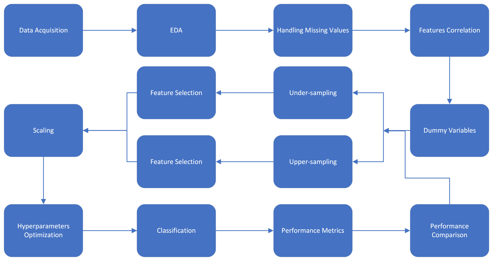

# Credit-Card-Fraud-Detection-Capstone-Project

- [Introduction](#introduction)
- [Flow Chart](#flowchart)

## Introduction  

**The Problem area**: Credit card fraud occurs when a customer uses a third party's credit card or information to make unauthorized purchases or cash advances. Credit card fraud happens both online and in physical stores. Merchants can avoid problems and bad reputations when they identify fraudulent use of credit cards in their payment environment. Credit card fraud detection is critical for companies to safeguard their customers' purchases and funds by detecting fraud before or as it occurs.

It's not always straightforward to agree on what fraud means. Regardless of how you define fraud, most payments are not fraudulent. Most merchants aren't experts at estimating the business impact of fraud.

Using Machine Learning for credit card fraud detection is an opportunity to create more efficient systems to avoid fraud. These systems will prevent fraud and avoid accusing legitimate purchases of fraud, too. This scenario will give the merchants more credibility, generating higher profits.

**The User**: Who experiences these problems? How would they benefit from the outcomes of your project?

Stakeholders, including issuers, banks, payment processors, and merchants, constantly seek ways to leverage multiple technological advancements to better align with their end-users preferences. In this context, they are always looking for ways to prevent fraud. As such, when a company commits fraud and incurs a significant loss, all stakeholders are directly or indirectly impacted. In some cases, employees may lose their jobs, consumers cannot access commodities, and surrounding communities may lose a significant source of tax revenue.

**The Big Idea**: How can machine learning bring solutions to these areas?

The problem of credit card fraud detection includes modeling past credit card transactions with knowledge of those that turned out to be fraud. A classification machine learning model can be used to identify whether a new transaction is fraudulent or not. The goal is to maximize the detection of fraudulent transactions while minimizing fraud misclassifications.

**The Impact**: What societal or business value do you anticipate your project to add? If possible, try to quantify the scale of the problem (in dollars, in CO2, in time spent, ...)

The FBI said it received 88,262 complaints overall from victims of fraud in the over-60 group last year. These sufferers reported $3.1 billion in losses, up almost $1 billion from 2021. The report found that the average dollar loss per victim totaled $35,101, with 5,456 victims losing more than $100,000.

In 2022, the Canadian Anti-Fraud Centre received fraud and cybercrime reports totaling $530$ million in victim losses—nearly a 40\% increase from the unprecedented $380$ million losses in 2021. Unfortunately, the increased reporting doesn't represent the actual financial loss, as the Canadian Anti-Fraud Centre estimates that only 5 to 10\% of people report fraud.

**The Data**: Identify several possible datasets in this subject area and describe them at a high level. Include references. If you struggle to find more than one or two datasets, this might mean a Data Science approach to the problem will be challenging. Check in with your Educator.

The [Data](https://www.kaggle.com/competitions/ieee-fraud-detection/data) will be used in the Brainstation capstone project were found in the IEEE-CIS Fraud Detection Kaggle's competition. The competition is currently closed, so I don't have access to the submissions. The data is formed by 590,540 transactions divided in 569,877 genuine transaction and 20,663 fraudulent transactions. The transactions contains money transfer and also other gifting goods and service, like you booked a ticket for others, etc. The dataset also has 394 fields as following:

- TransactionDT: timedelta from a given reference datetime (not an actual timestamp). It first value is 86400, which corresponds to the number of seconds in a day (60 * 60 * 24 = 86400) so the unit is seconds. Using this, we know the data spans 6 months, as the maximum value is 15811131, which would correspond to day 183.
- TransactionAMT: transaction payment amount in USD.
- ProductCD: product code, the product for each transaction. Product isn't necessary to be a real 'product' (like one item to be added to the shopping cart). It could be any kind of service.
- card1 - card6: payment card information, such as card type, card category, issue bank, country, etc.
- addr: Address. Both addresses are for purchaser. addr1 as billing region and addr2 as billing country.
- dist: distances between (not limited) billing address, mailing address, zip code, IP address, phone area, etc.
- P\_ and (R\_\_) emaildomain: purchaser and recipient email domain. Certain transactions don't need recipient, so R\_ emaildomain is null.”
- C1-C14: counting, such as how many addresses are found to be associated with the payment card, etc. The actual meaning is masked. Counts of phone numbers, email addresses, names associated with the user, device, ipaddr, billingaddr, etc. Also these are for both purchaser and recipient, which doubles the number.
- D1-D15: timedelta, such as days between previous transaction, etc.
- M1-M9: match, such as names on card and address, etc.
- Vxxx: Vesta engineered rich features, including ranking, counting, and other entity relations. For example, how many times the payment card associated with a IP and email or address appeared in 24 hours time range, etc. All Vesta features were derived as numerical. Some of them are count of orders within a clustering, a time-period or condition, so the value is finite and has ordering (or ranking).

## Flow Chart  

